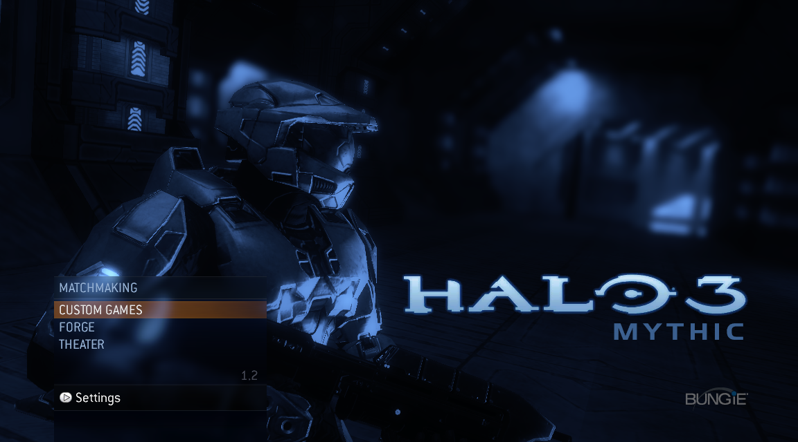
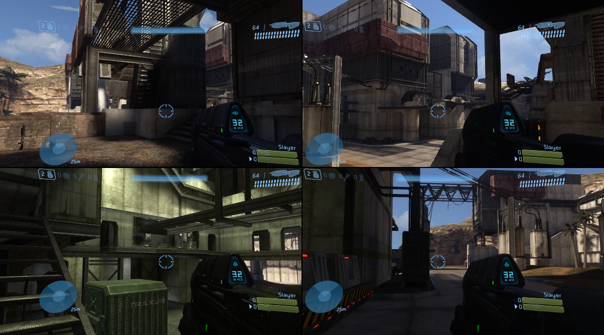
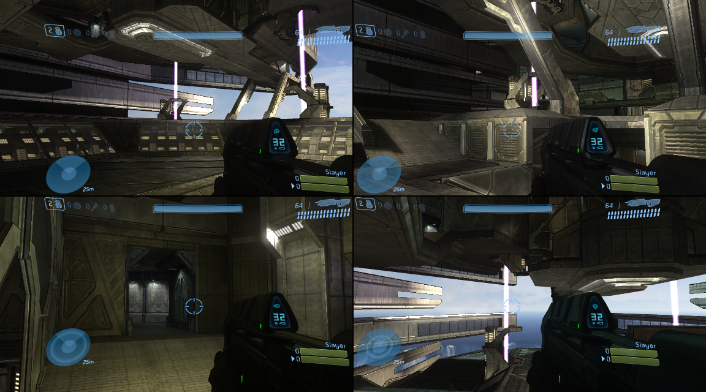

# Open Halo 3 Mythic

**OpenH3M** is a native Windows x64 static recompilation of the Halo 3 Mythic multiplayer disc included with Halo 3: ODST. Beta 0.8 brings the complete 3D menu presentation, Custom Games, local split screen, and Forge to PC through the [ReXGlue SDK](https://github.com/rexglue/rexglue-sdk).

OpenH3M does not distribute game data. You must supply files extracted from a legally obtained Halo 3: ODST Multiplayer Disc (Disc 2).

## Screenshots

[](docs/images/mythic-menu.png)

| Four-player Last Resort | Four-player Construct |
| --- | --- |
| [](docs/images/last-resort-four-player.png) | [](docs/images/construct-four-player.png) |

## Status

| Feature | Beta 0.8 status |
| --- | --- |
| Custom Games | Working |
| Local split screen | Working with 1-4 players |
| Forge | Working; D-pad Up switches between player and build modes |
| Theater | Mode is reachable; recording and saved-film playback are not fully validated |
| System Link | Untested |
| Matchmaking | **Not supported and never will be supported** |
| Xbox LIVE | Not supported and out of scope |

The game targets its original 30 FPS cap. The current build displays measured FPS in the window title bar and has been smoke-tested through four-player gameplay.

## Requirements

- Windows 10 or Windows 11, 64-bit
- A Direct3D 12-capable GPU
- A legally obtained Halo 3: ODST Multiplayer Disc (Disc 2)
- An Xbox-compatible controller is strongly recommended, especially for split screen

## Install

1. Download `OpenH3M-beta-0.8-win-x64.zip` from the GitHub Releases page and extract it.
2. Create a folder named `game` beside `OpenH3M.exe`.
3. Extract the disc's filesystem into `game` with an Xbox/XDVDFS extraction tool, preserving its directory structure.
4. Confirm that `game\default.xex` and `game\maps\` exist.
5. Run `OpenH3M.exe`.

OpenH3M automatically uses the adjacent `game` folder and starts windowed at 1280x720 with the validated Direct3D 12 settings. No launcher script or command-line arguments are required.

## Controls

Xbox/XInput controllers use the original game controls. Additional local players can join supported lobbies or an in-progress local game with their controller's Start button.

The optional Player 1 keyboard mapping is:

| Keyboard | Xbox control |
| --- | --- |
| W, A, S, D | Left stick |
| Arrow keys | D-pad |
| Enter or Space | A |
| Escape or Backspace | B |
| X / Y | X / Y |
| P / O | Start / Back |
| Q / E | Left bumper / Right bumper |

## Building

Developer setup, generation, build, and diagnostic notes are in [halo3mp/BUILD.md](halo3mp/BUILD.md). A release package can be assembled after a release build with:

```powershell
cmake --build --preset win-amd64-release -- -j 2
.\tools\package_release.ps1
```

Run those commands from the `halo3mp` directory.

## Acknowledgments

OpenH3M is powered by the [ReXGlue SDK](https://github.com/rexglue/rexglue-sdk). Thank you to the ReXGlue team for building and maintaining the Xbox 360 recompilation toolkit that makes this project possible.

## Legal

OpenH3M is an independent preservation and compatibility project. It is not affiliated with or endorsed by Microsoft, Xbox, Bungie, or 343 Industries. Halo and all related trademarks and game assets belong to their respective owners. No copyrighted game data is included.
